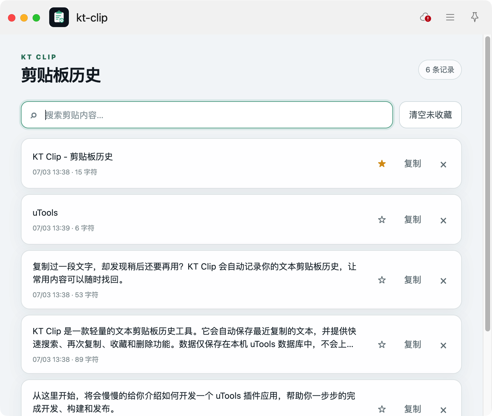
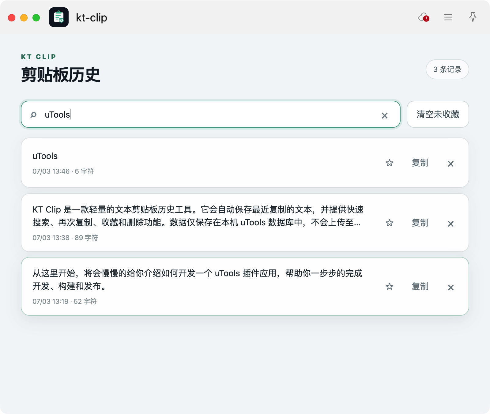
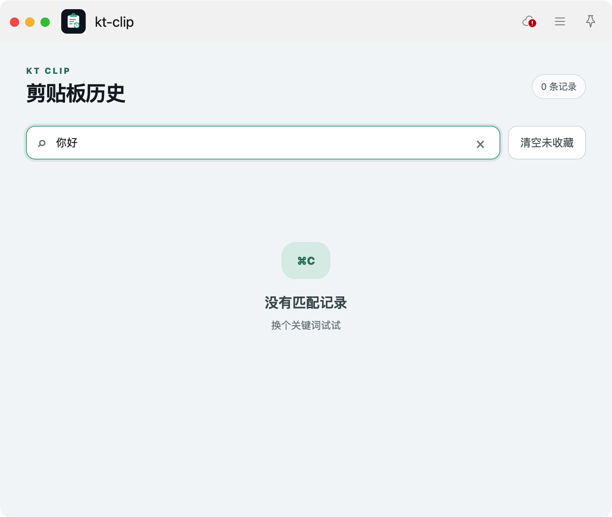
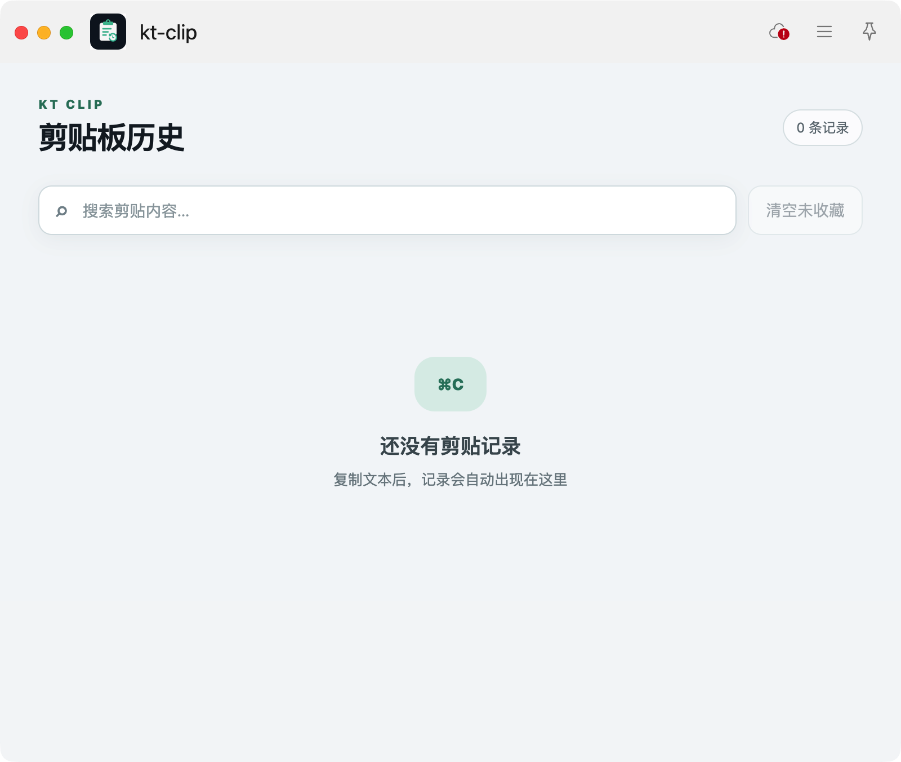

# KT Clip

一款轻量、本地优先的 uTools 文本剪贴板历史插件。

KT Clip 自动记录最近复制的文本，提供搜索、再次复制、收藏和清理能力，帮助你快速找回和复用剪贴内容。数据仅保存在本机 uTools 数据库中，不依赖账号或云端服务。

## 产品目标

用尽可能简单、可靠的方式解决“复制过的文本难以再次找到”这一问题。插件专注于剪贴板历史这一项核心能力，让用户通过 uTools 指令即可快速使用，无需复杂配置。

## 核心优势

- **轻量直接**：无需注册，通过 uTools 指令即可打开。
- **快速查找**：历史记录按最近使用时间排列，支持关键词实时筛选。
- **重点保留**：收藏内容优先展示，批量清理时不会被删除。
- **本地优先**：剪贴内容仅保存在本机 uTools 数据库中。
- **数据可控**：支持删除单条记录或一键清空未收藏记录。
- **界面清晰**：支持浅色和深色外观。

## 功能

- 自动记录文本剪贴板内容
- 搜索剪贴板历史
- 点击记录再次复制
- 收藏或取消收藏记录
- 删除单条记录
- 清空全部未收藏记录
- 最多保留 200 条未收藏记录
- 相同内容再次复制时更新最近使用时间

## 界面预览

### 剪贴板历史



### 搜索记录



### 无匹配结果



### 空记录状态



## 使用方式

在 uTools 搜索框中输入以下任一指令：

- `剪贴板历史`
- `剪贴记录`
- `Clipboard History`

打开插件后，复制的文本会自动显示在历史列表中。详细操作参见[用户手册](release/USER_GUIDE.md)。

## 隐私说明

- 仅处理文本剪贴板，不记录图片或文件。
- 所有记录仅保存在本机 uTools 数据库中。
- 不提供云同步，不会上传或分享剪贴内容。
- 剪贴板可能包含密码、验证码、令牌或密钥，请及时删除敏感记录。

完整内容参见[隐私说明](release/PRIVACY.md)。

## 本地开发

环境要求：Node.js 与 npm。

```bash
npm install
npm run dev
```

开发模式入口已配置在 `public/plugin.json`，通过 uTools 开发者工具载入该文件进行调试。

## 生产构建

```bash
npm run build
```

构建产物输出到 `dist/`。发布时，在 uTools 开发者工具中选择 `dist/` 作为版本目录。

## 发布资料

- [应用市场文案](release/marketplace.md)
- [用户手册](release/USER_GUIDE.md)
- [隐私说明](release/PRIVACY.md)
- [发布检查清单](release/CHECKLIST.md)

